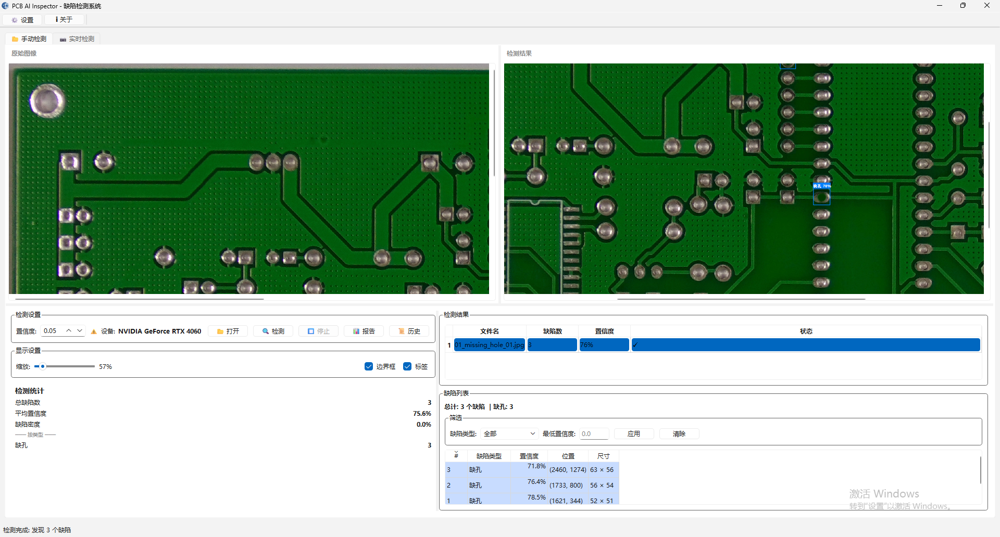
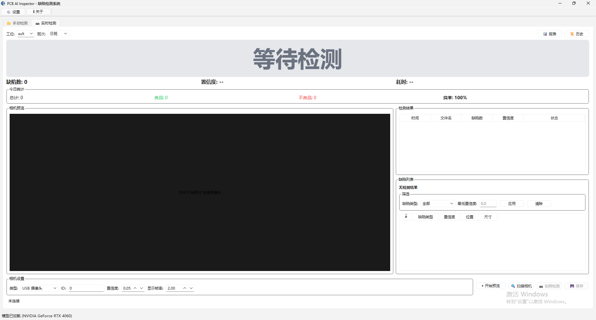

# PCB AI Inspector

基于 YOLO11 的 PCB 缺陷智能检测系统。

## 功能特性

- 🔍 **AI 缺陷检测** - 支持 10 种 PCB 缺陷类型检测
- 📊 **本地离线运行** - 无需联网，保护数据隐私
- ⚡ **GPU/CPU 自适应** - 自动检测并使用可用硬件加速
- 📄 **报告导出** - 支持 PDF 和 Excel 格式报告
- 📜 **检测历史** - 自动记录所有检测结果，随时查看统计
- ⚙️ **灵活设置** - 可自定义检测参数、显示选项、报告格式
- 🔐 **授权管理** - 支持离线激活和试用版本
- 🖥️ **友好界面** - PyQt6 开发的桌面客户端
- 🏭 **工业场景** - 支持生产线配置、质量控制、数据追溯
- 📱 **相机支持** - USB 摄像头和 GigE 工业相机

## 适用场景

- 毕设/课程设计 - 计算机视觉、深度学习实战项目
- 工业质检外包 - 小型SMT代工厂来料检测
- 教学实验 - YOLO目标检测、PyTorch部署实训
- 安全监控 - 生产线异常、产品表面缺陷检测
- 创新创业大赛 - "互联网+"、挑战杯等参赛作品
- 产品原型验证 - 快速搭建AI检测POC
- 小批量生产 - 质检数据记录与追溯
- 行业迁移 - 适配其他产品表面缺陷检测

## 支持的缺陷类型

| 缺陷类型 | 英文名 | 说明 |
|---------|--------|------|
| 短路 | short_circuit | 相邻导线间距过近 |
| 开路 | open_circuit | 导线或焊盘断裂 |
| 缺孔 | missing_hole | 预期孔位缺失 |
| 毛刺 | spur | 导线边缘突出 |
| 鼠咬 | mousebite | 导线边缘缺口 |
| 多余铜皮 | spurious_copper | 非设计铜皮区域 |
| 孔 breakout | hole_breakout | 孔周围铜皮延伸 |
| 导体划痕 | conductor_scratch | 导体表面划痕 |
| 异物 | foreign_object | PCB 上外来物体 |
| 针孔 | pin_hole | 微小孔洞

## 演示





[演示视频](public/PCB-AI-Inspector.mp4)

## 快速开始

### 环境要求

- Python 3.11.9
- Windows 10/11 (64位)
- 可选: NVIDIA GPU (GTX 1650+)

### 安装

```bash
# 克隆项目
git clone <repository-url>
cd pcb-ai-inspector

# 创建虚拟环境
conda create -n pcb-ai python=3.11.9 -y
conda activate pcb-ai

# 安装依赖
pip install -r requirements.txt

# 安装包（可编辑模式）
pip install -e .
```

### 运行应用

```bash
python -m pcb_ai_inspector
```

## 配置说明

所有配置通过 `设置` 对话框进行管理，配置会自动保存到 `~/.pcb-ai-inspector/settings.json`。

### 窗口设置

| 参数 | 说明 | 默认值 |
|------|------|--------|
| 窗口标题 | 主窗口标题 | PCB AI Inspector - 缺陷检测系统 |
| 尺寸预设 | 窗口预设大小 | 标准 (1280x720) |
| 最小宽度 | 最小窗口宽度 | 1280 |
| 最小高度 | 最小窗口高度 | 720 |
| 允许调整大小 | 是否允许调整窗口 | 是 |
| 启动时最大化 | 启动时最大化窗口 | 否 |

### 布局设置

| 参数 | 说明 | 默认值 |
|------|------|--------|
| 图像区域比例 | 上方面板占比 | 0.7 |
| 显示工具栏 | 是否显示工具栏 | 是 |
| 显示状态栏 | 是否显示状态栏 | 是 |
| 显示菜单栏 | 是否显示菜单栏 | 是 |
| 主题 | UI 主题 | 浅色 |
| 语言 | 界面语言 | 中文 |
| 相机对话框宽度 | 相机对话框默认宽度 | 900 |
| 相机对话框高度 | 相机对话框默认高度 | 700 |
| 预览区域宽度 | 相机预览区最小宽度 | 640 |
| 预览区域高度 | 相机预览区最小高度 | 480 |
| 历史对话框宽度 | 历史记录对话框宽度 | 800 |
| 历史对话框高度 | 历史记录对话框高度 | 500 |
| 报告预览宽度 | 报告预览对话框宽度 | 800 |
| 报告预览高度 | 报告预览对话框高度 | 600 |

### 检测设置

| 参数 | 说明 | 默认值 |
|------|------|--------|
| 置信度阈值 | 检测置信度阈值 | 0.25 |
| IOU 阈值 | NMS IOU 阈值 | 0.45 |
| 最大检测数 | 单图最大检测数 | 100 |
| 自动保存结果 | 自动保存检测结果 | 是 |
| 保存标注图像 | 保存带标注的图像 | 是 |
| 启用过滤 | 启用尺寸过滤 | 是 |
| 最小缺陷尺寸 | 最小缺陷尺寸(像素) | 10 |
| 最大缺陷尺寸 | 最大缺陷尺寸(像素) | 5000 |

### 预处理设置（工业相机）

| 参数 | 说明 | 默认值 |
|------|------|--------|
| 启用预处理 | 启用图像预处理 | 是 |
| 光照预设 | 光照条件预设 | 自动检测 |
| 启用去噪 | 启用高斯去噪 | 是 |
| 去噪核大小 | 高斯核大小(奇数) | 3 |
| 二值化方法 | 图像二值化方法 | 自适应高斯 |
| 自适应块大小 | 自适应阈值块大小 | 11 |
| 阈值常数 C | 自适应阈值常数 | 2 |
| 启用 CLAHE | 启用对比度增强 | 是 |
| CLAHE 限制 | 对比度增强限制 | 2.0 |
| 启用 ROI | 启用自动 ROI 提取 | 是 |
| ROI 边缘留白 | ROI 边缘留白像素 | 10 |

### 相机设置

| 参数 | 说明 | 默认值 |
|------|------|--------|
| 相机类型 | USB/GigE 相机 | USB |
| 相机 ID | 相机标识符 | 0 |
| 分辨率 | 图像分辨率 | 1920x1080 |
| 曝光时间 | 曝光时间(微秒) | 10000 |
| 增益 | 相机增益 | 0.0 |
| 触发模式 | 采集触发模式 | 连续采集 |
| 超时时间 | 超时时间(毫秒) | 5000 |
| 帧率限制 | 最大帧率 | 0(无限制) |

### 工业场景设置

| 参数 | 说明 | 默认值 |
|------|------|--------|
| 生产线 | 生产线名称 | default |
| 工位 | 工位名称 | default |
| 班次 | 班次配置 | 日班 |
| 通过阈值 | 合格阈值 | 0.8 |
| 关键缺陷直接不合格 | 关键缺陷判定 | 是 |
| 启用缺陷分级 | 缺陷严重性分级 | 是 |
| 启用数据追溯 | 数据追溯功能 | 是 |
| 保存原始图像 | 保存原始图像 | 否 |
| 启用缺陷报警 | 缺陷报警功能 | 否 |
| 报警阈值 | 触发报警的缺陷数 | 0 |

## 项目结构

```
pcb-ai-inspector/
├── src/
│   └── pcb_ai_inspector/
│       ├── core/           # 核心定义 (缺陷类型、设置)
│       ├── models/         # AI 模型 (YOLO 检测器)
│       ├── reports/        # 报告生成 (PDF/Excel)
│       ├── ui/             # 界面组件
│       ├── utils/          # 工具函数
│       └── utils/          # 工具函数
├── docs/                   # 文档
└── Makefile               # 开发命令
```

## 开发

```bash
# 安装开发依赖
pip install -e ".[dev]"

# 格式化代码
make format

# 运行检查
make lint

# 运行测试
make test
```

详细开发文档请查看 [DEVELOPMENT.md](DEVELOPMENT.md)

## 性能指标

| 指标 | 目标 | 实际 |
|------|------|------|
| mAP50 | ≥82% | ~95% |
| Recall | ≥80% | ~93% |
| Precision | ≥85% | ~99.6% |

## License

AGPL-3.0 License